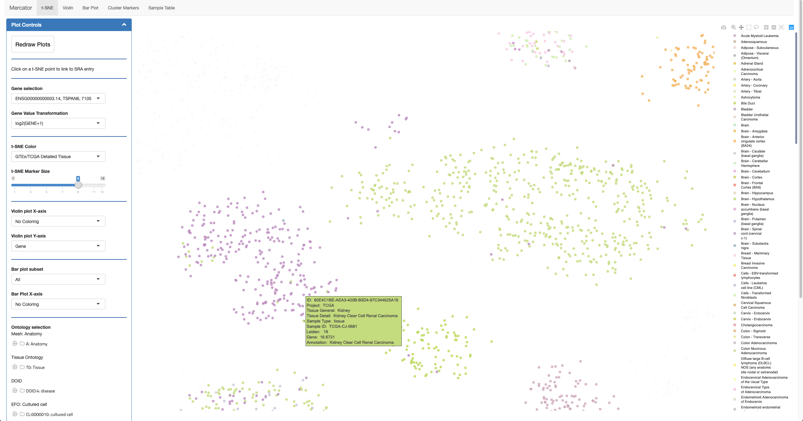
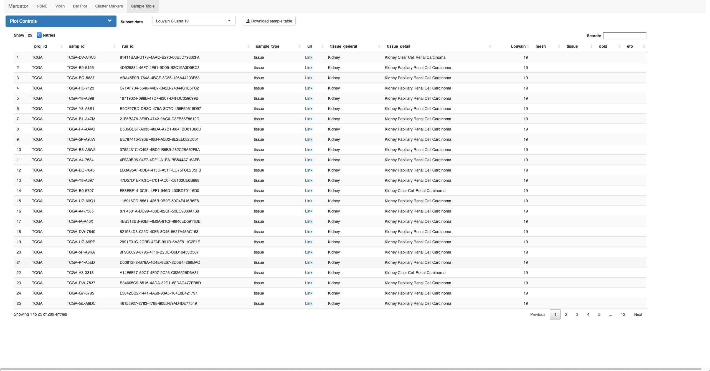

```{r setup, echo=0, warning=0, message=0}
library(recount)
options(stringsAsFactors=F)
library(DESeq2)
```

If you view the t-SNE colored by TCGA/GTEx detailed tissue annotations, you will see some TCGA samples cluster with different cancer subtypes. Many of these are noted in the various TCGA publications, but aren't available on the TCGA data portal. 
Here, we'll show you how to use Mercator to identify these samples and download their counts from recount.



Clearly, there's something strange going on with these TCGA samples. You can download the id's of these samples from the sample download page:



Great, now you can download the TCGA gene count data using the [recount package](https://bioconductor.org/packages/release/bioc/html/recount.html).

```r
options(stringsAsFactors=F)
library(recount)

download_study('TCGA')
```

These gene counts can be easily subsetted using the sample tables from the relevant clusters.
In this case, there is an updated metadata table available from [*Ricketts et al., 2018*](https://dx.doi.org/10.1016%2Fj.celrep.2018.03.075)

```{r subsetting-tcga, message=0, warning=0}
## load(file.path('data/TCGA',"rse_gene.Rdata"))
## tcga.cnts <- assays(rse_gene)$counts

for(i in 1:ncol(tcga.cnts)){
    if(max(tcga.cnts[,i]) > .Machine$integer.max){
        tcga.cnts[,i] <- tcga.cnts[,i] * (.Machine$integer.max) / (max(tcga.cnts[,i]))}}


cluster.19 <- read.table('data/cluster_19.csv',sep=',',header=T)
cluster.21 <- read.table('data/cluster_21.csv',sep=',',header=T)
kidney.df <- rbind(cluster.19,cluster.21)
rownames(kidney.df) <- kidney.df$run_id

ricketts.meta <- read.table('data/patient_genetic_clinical_info.csv',sep=',',header=T)
ricketts.meta <- subset(ricketts.meta,bcr_patient_barcode != '')
rownames(ricketts.meta) <- ricketts.meta$bcr_patient_barcode

kidney.df$ricketts <- ricketts.meta[kidney.df$samp_id,'PanKidney.Pathology']
kidney.df <- subset(kidney.df,!is.na(ricketts))

tcga.cnts <- tcga.cnts[,kidney.df$run_id]
rm(rse_gene) ## clean up

```

Once we have the relevant metadata, we can do differential expression between the various groups. Here, we use a simple DESeq2 workflow.

```r
library(DESeq2)

set.seed(123)

### We'll do each pair separately, in order to ease computation time

## ccRCC sub-cluster vs ccRCC
## we repeat this ten times in order to subsample the ccRCC samples to have the same number as the pRCC samples

prcc.n <- nrow(subset(kidney.df,Louvain == 19 & ricketts %in% c('PRCC T1','PRCC T2')))

c.s.combined <- as.data.frame(matrix(0,nrow=nrow(cnt.amt),ncol=4))
rownames(c.s.combined) <- rownames(cnt.mat)
colnames(c.s.combined) <- c('padj','log2FoldChange','baseMean','origFC')

for(i in 1:10){

    sub.df <- subset(kidney.df,ricketts=='ccRCC' & Louvain == 19)
    ccr.df <- subset(kidney.df,ricketts=='ccRCC' & Louvain == 21)
    ccr.df <- ccr.df[sample(1:nrow(ccr.df),prcc.n),]
    
    meta.df <- rbind(sub.df,ccr.df)
    meta.df$Louvain <- factor(meta.df$Louvain)

    c.s.dds <- DESeqDataSetFromMatrix(countData = tcga.cnts[,rownames(meta.df)],
                                      colData = meta.df,
                                      design = ~Louvain)

    express.genes <- rowSums(counts(c.s.dds))

    c.s.dds <- c.s.dds[express.genes >= 10,]
    c.s.dds <- DESeq(c.s.dds,fitType='local',parallel=TRUE,BPPARAM=MulticoreParam(9))

    fold.change.vec <- results(c.s.dds)$log2FoldChange

    ## fold.change.vec <- c(fold.change.vec,abs(results(c.s.dds)$log2FoldChange))         ## we keep track of the fold changes to threshold them later

    c.s.shrunk <- lfcShrink(c.s.dds,coef=2,BPPARAM=MulticoreParam(9),parallel=TRUE,type='apeglm',lfcThreshold=0)
    c.s.shrunk$origFC <- fold.change.vec

    common.genes <- intersect(rownames(c.s.combined),rownames(c.s.shrunk))

    c.s.combined <- c.s.combined[common.genes,]
    c.s.shrunk <- c.s.shrunk[common.genes,]

    c.s.combined <- c.s.combined + data.frame(padj = log10(c.s.shrunk$padj),
                                              log2FoldChange = c.s.shrunk$log2FoldChange,
                                              baseMean = log10(c.s.shrunk$baseMean),
                                              origFC = c.s.shrunk$origFC)

}

c.s.combined$padj <- 10^(c.s.combined$padj/10)
c.s.combined$log2FoldChange <- c.s.combined$log2FoldChange/10
c.s.combined$baseMean <- 10^(c.s.combined$baseMean/10)
c.s.combined$origFC <- c.s.combined$origFC/10

## ccRCC vs pRCC

meta.df <- subset(kidney.df,(ricketts== 'ccRCC' & Louvain == 21) | (ricketts == 'PRCC T1' & Louvain == 19) | (ricketts == 'PRCC T2' & Louvain == 19))
meta.df$Louvain <- factor(meta.df$Louvain)

c.p.dds <- DESeqDataSetFromMatrix(countData = tcga.cnts[,rownames(meta.df)],
                              colData = meta.df,
                              design = ~Louvain)

express.genes <- rowSums(counts(c.p.dds))

c.p.dds <- c.p.dds[express.genes >= 10,]
c.p.dds <- DESeq(c.p.dds,fitType='local',parallel=TRUE,BPPARAM=MulticoreParam(9)) ## we run this on a large 93gb and 10 core HPC node
c.p.shrunk <- lfcShrink(c.p.dds,coef=2,BPPARAM=MulticoreParam(9),parallel=TRUE,type='apeglm',lfcThreshold=0) ## shrink FC's to determine genes with high fold changes


## ccRCC sub-cluster vs pRCC

meta.df <- subset(kidney.df,(ricketts == 'ccRCC' & Louvain == 19) | (ricketts == 'PRCC.T2' & Louvain == 19) | (ricketts == 'PRCC.T1' & Louvain == 19))
meta.df$ricketts <- factor(meta.df$ricketts)

s.p.dds <- DESeqDataSetFromMatrix(countData = tcga.cnts[,rownames(meta.df)],
                              colData = meta.df,
                              design = ~ricketts)

express.genes <- rowSums(counts(s.p.dds))

s.p.dds <- s.p.dds[express.genes >= 10,]
s.p.dds <- DESeq(s.p.dds,fitType='local',parallel=TRUE,BPPARAM=MulticoreParam(9)) ## we run this on a large 93gb and 10 core HPC node
s.p.shrunk <- lfcShrink(s.p.dds,coef=2,BPPARAM=MulticoreParam(9),parallel=TRUE,type='apeglm',lfcThreshold=0) ## shrink FC's to determine genes with high fold changes


```

We can see from these results that there are many more differentially expressed genes between ccRCC-sub and ccRCC than ccRCC-sub and pRCC.

```{r load-de-dat, echo=0, warning=0, message=0}

s.p.shrunk <- read.table('data/kidney_pRCC_vs_ccRCCsub_deseq2_lfcShrink.csv',sep=',',header=T)
c.p.shrunk <- read.table('data/kidney_pRCC_vs_ccRCC_deseq2_lfcShrink.csv',sep=',',header=T)
c.s.combined <- read.table('data/kidney_ccRCC_vs_ccRCCsub_deseq2_lfcShrink_submsampled_combined.csv',sep=',',header=T)

lfc.thresh <- 0.5703626

```

```r

#### threshold genes by median fold change

lfc.thresh <- median(abs(c(results(s.p.dds)$log2FoldChange,
                           results(c.p.dds)$log2Foldchange,
                           c.s.combined$origFC))) 

rm(s.p.dds)
rm(c.p.dds) ## cleanup our workspace a little bit

```

```{r de-plots, warning=0, message=0}

library(ggplot2)
library(RColorBrewer)
library(scales)

message(sprintf('log2 Fold Change threshold: %f',lfc.thresh))

################################################################
#### overlap volcano plot, sub-ccRCC vs ccRCC and pRCC vs ccRCC
################################################################

color.pal <- brewer.pal(3,'Dark2')

markers.both.pos <- intersect(rownames(subset(c.p.shrunk,padj <= 1e-2 & log2FoldChange > lfc.thresh)),rownames(subset(c.s.combined,padj <= 1e-2 & log2FoldChange > lfc.thresh)))
markers.both.neg <- intersect(rownames(subset(c.p.shrunk,padj <= 1e-2 & log2FoldChange < -lfc.thresh)),rownames(subset(c.s.combined,padj <= 1e-2 & log2FoldChange < -lfc.thresh)))
markers.both <- c(markers.both.pos,markers.both.neg)

only.sub <- setdiff(rownames(subset(c.s.combined,padj <= 1e-2 & abs(log2FoldChange) > lfc.thresh)),markers.both)

plot.df <- data.frame(padj=-1*log10(c.s.combined$padj),log2FoldChange=-1*c.s.combined$log2FoldChange) ## ccRCC is positive, so switch so sub-ccRCC is on top
plot.df[is.na(plot.df$padj),'padj'] <- 0
rownames(plot.df) <- rownames(c.s.combined)

plot.df$sig <- 'Not'
plot.df[only.sub,'sig'] <- 'Only sub'
plot.df[markers.both,'sig'] <- 'Both'
plot.df$sig <- factor(plot.df$sig,levels=c('Only sub','Both','Not'),
                      labels=c('Sub Only','Both','Not sub'))

plot.df$over <- 'N'
plot.df[plot.df$padj > 40,'over'] <- 'Y'

plot.df$plotP <- plot.df$padj
plot.df[plot.df$padj > 40,'plotP'] <- 40 ### threshold for y-axis stability

max.x <- max(abs(plot.df$log2FoldChange))
amacr.krt7 <- plot.df[c('ENSG00000242110.7','ENSG00000135480.14'),]

g <- ggplot() + geom_point(data=plot.df,aes(x=log2FoldChange,y=plotP,colour=sig,shape=over,alpha=sig)) +
    geom_point(data=amacr.krt7,aes(x=log2FoldChange,y=plotP),shape=21,size=2,fill=NA,colour='black',stroke=2) +
    ggtitle(sprintf('DE genes sub vs ccRCC: %d',sum(plot.df$padj > 2 & abs(plot.df$log2FoldChange) > lfc.thresh))) +
    geom_vline(xintercept=lfc.thresh) +
    geom_vline(xintercept=-1*lfc.thresh) +
    scale_shape_manual(values=c('N'=16,'Y'=17),guide=FALSE) +
    scale_colour_manual(values=c(color.pal[1],color.pal[2],'Grey'),name='Significance') +
    scale_alpha_manual(values=c(0.6,0.6,0.6),guide=FALSE) +
    scale_y_continuous(name='p-value',
                       breaks=c(0,10,20,30,40),
                       labels=c(parse(text='10^0'),parse(text='10^-10'),parse(text='10^-20'),parse(text='10^-30'),parse(text='10^-40'))) +
    xlim(-1*max.x,max.x) +
    theme(legend.text=element_text(size=12),
          axis.title=element_text(size=12),
          legend.title=element_blank()) +
    guides(shape=FALSE)

g

################################################################
#### overlap volcano plot, sub-ccRCC vs pRCC and ccRCC vs pRCC
################################################################

markers.both.pos <- intersect(rownames(subset(c.p.shrunk,padj <= 1e-2 & log2FoldChange > lfc.thresh)),rownames(subset(s.p.shrunk,padj <= 1e-2 & log2FoldChange > lfc.thresh)))
markers.both.neg <- intersect(rownames(subset(c.p.shrunk,padj <= 1e-2 & log2FoldChange < -lfc.thresh)),rownames(subset(s.p.shrunk,padj <= 1e-2 & log2FoldChange < -lfc.thresh)))
markers.both <- c(markers.both.pos,markers.both.neg)

only.sub <- setdiff(rownames(subset(s.p.shrunk,padj <= 1e-2 & abs(log2FoldChange) > lfc.thresh)),markers.both)

plot.df <- data.frame(padj=-1*log10(s.p.shrunk$padj),log2FoldChange=-1*s.p.shrunk$log2FoldChange) ## ccRCC is positive, so switch so sub-ccRCC is on top
plot.df[is.na(plot.df$padj),'padj'] <- 0
rownames(plot.df) <- rownames(s.p.shrunk)

plot.df$sig <- 'Not'
plot.df[only.sub,'sig'] <- 'Only sub'
plot.df[markers.both,'sig'] <- 'Both'
plot.df$sig <- factor(plot.df$sig,levels=c('Only sub','Both','Not'),
                      labels=c('Sub Only','Both','Not sub'))

plot.df$over <- 'N'
plot.df[plot.df$padj > 40,'over'] <- 'Y'

plot.df$plotP <- plot.df$padj
plot.df[plot.df$padj > 40,'plotP'] <- 40 ### threshold for plot simplicity

max.x <- max(abs(plot.df$log2FoldChange))

g <- ggplot() + geom_point(data=plot.df,aes(x=log2FoldChange,y=plotP,colour=sig,shape=over,alpha=sig)) +
    ## geom_point(data=amacr.krt7,aes(x=log2FoldChange,y=plotP),shape=21,size=2,fill=NA,colour='black',stroke=2) +
    ggtitle(sprintf('DE genes sub vs pRCC: %d',sum(plot.df$padj > 2 & abs(plot.df$log2FoldChange) > lfc.thresh))) +
    geom_vline(xintercept=lfc.thresh) +
    geom_vline(xintercept=-1*lfc.thresh) +
    scale_shape_manual(values=c('N'=16,'Y'=17),guide=FALSE) +
    ## scale_colour_manual(values=c(color.pal[1],color.pal[2],'Grey')) +
    scale_colour_manual(values=c(color.pal[1],color.pal[2],'Grey'),name='Significance') +
    scale_alpha_manual(values=c(0.6,0.6,0.6),guide=FALSE) +
    scale_y_continuous(name='p-value',
                       breaks=c(0,10,20,30,40),
                       labels=c(parse(text='10^0'),parse(text='10^-10'),parse(text='10^-20'),parse(text='10^-30'),parse(text='10^-40'))) +
    xlim(-1*max.x,max.x) +
    theme(legend.text=element_text(size=12),
          axis.title=element_text(size=12),
          legend.title=element_blank()) +
    ## scale_y_log10(breaks = trans_breaks("log10", function(x) 10^x),
    ##               labels = trans_format("log10", math_format(10^.x))) +

    ## scale_colour_manual(values=c('Not'='Grey','Only sub'=color.pal[1],'Both' =color.pal[2])) +
    guides(shape=FALSE)

g

```

As we can see, there are many more DE genes between the sub-cluster versus ccRCC compared to the sub-cluster versus pRCC.
We can also perform Gene Ontology enrichment analysis to determine if the sub-cluster is enriched in genes relating to similar processes identified in Ricketts et al.

```{r go-analysis, warning=0, message=0}
library(goseq)

gene.df <- read.table('data/ensembl_gene_lengths.tsv',sep='\t',row.names=1)
gene.lens <- gene.df[,1]
names(gene.lens) <- rownames(gene.df)
gene.lens <- gene.lens[!grepl('PAR',names(gene.lens))]
names(gene.lens) <- gsub('[.].*','',names(gene.lens))

gene.sig <- as.integer(c.s.combined$padj <= 0.01 & abs(c.s.combined$log2FoldChange) > lfc.thresh)
names(gene.sig) <- rownames(c.s.combined)
gene.sig[is.na(gene.sig)] <- 0

gene.sig <- gene.sig[!grepl('PAR',names(gene.sig))]         ## Remove Ensembl version numbers and resulting duplicates from recount2 data
names(gene.sig) <- gsub('[.].*','',names(gene.sig))

pwf <- nullp(gene.sig,'hg38','ensGene',bias.data = gene.lens[names(gene.sig)],plot.fit=T)
go.wall <- goseq(pwf,'hg38','ensGene')
go.wall$padj <- p.adjust(go.wall$over_represented_pvalue,'BH')

subset(go.wall,padj <= 0.05 & grepl('amino acid',term))

```
