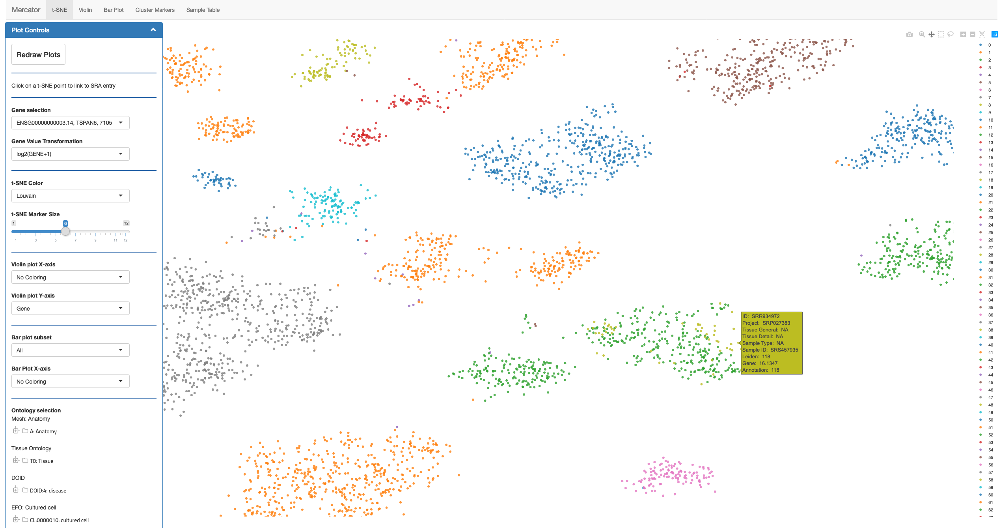
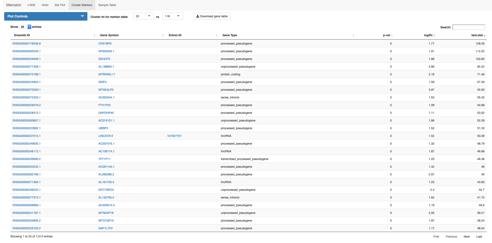

```{r setup, echo=0, warning=0, message=0}

options(stringsAsFactors=F)

```

Viewing the clustering t-SNE reveals a group of glioma samples that cluster in the t-SNE but not in our Leiden clustering.
Leiden clustering specifically breaks up clusters that are not well-connected internally, so we can surmise that these samples exhibit some strange transcriptional patterns compared to the other neighboring glioma samples.



A simple idea of the transcriptional differences can be downloaded from the gene table view by selecting clusters 32 and 118, the two glioma clusters.



We can also download sample ID's from the sample table view, then use a workflow similar to the one in the kidney vignette to calculate differentially expressed genes. 
In this case, we restricted the gene set to those that were used in the clustering, in order to specificially look at genes that contributed to the clustering.

```r

all.sample.table <- read.table('data/all_samples.csv',sep=',',header=T,row.names=1,stringsAsFactors=F)

cluster.32 <- subset(all.sample.table,Louvain==32)
cluster.118 <- subset(all.sample.table,Louvain==118)

cluster.32.118.samples <- c(cluster.32$run_id,cluster.118$run_id) ### some samples actually have multiple RNA-seq runs, so recount ID's by runs

var.genes <- readRDS('data/recount_over50_pc3sd_tpm_log_90th_perc_var_genes.RDS') ### top variable genes that add up to 90% of total variance, used in clustering

### build count matrix from cluster 32 and 118 projects downloaded using recount package
cnt.mat <- cnt.mat[var.genes,cluster.32.118.samples]

### we found the data had marker genes that were occasionally driven by dropouts (likely due to bad RNA libraries), so we removed genes that were highly non-expressed in either dataset

cnt.32 <- cnt.mat[,cluster.32$run_id]
cnt.32.pct.dropped <- apply(cnt.32,1,function(x) sum(x <= 2)) / ncol(cnt.32)
cnt.32.drop.genes <- cnt.32.pct.dropped > 0.25

cnt.118 <- cnt.mat[,cluster.118$run_id]
cnt.118.pct.dropped <- apply(cnt.118,1,function(x) sum(x <= 2)) / ncol(cnt.118)
cnt.118.drop.genes <- cnt.118.pct.dropped > 0.25

cnt.mat <- cnt.mat[!(cnt.32.drop.genes | cnt.118.drop.genes),]

cluster.32.118 <- rbind(cluster.32,cluster.118)
cluster.32.118$Louvain <- as.factor(cluster.32.118$Louvain)
rownames(cluster.32.118) <- cluster.32.118$run_id

dds <- DESeqDataSetFromMatrix(countData=cnt.mat,
                              colData=cluster.32.118,
                              design = ~Louvain)

dds <- estimateSizeFactors(dds)

## an additional filter for lowly expressed genes

express.genes <- rowSums(counts(dds,normalized=TRUE))
dds <- dds[express.genes >= ncol(dds),] 

## we ran this on a 9-core, 93GB HPC node at Scripps Research
no.cores <- 9 

dds <- DESeq(dds,fitType='local',parallel=TRUE,BPPARAM=MulticoreParam(no.cores))
res.shrunk <- lfcShrink(dds,coef=2,BPPARAM=MulticoreParam(no.cores),parallel=TRUE,type='apeglm')

```

```{r load-results, echo=0, warning=0, message=0}

res.shrunk <- read.table('data/glioma_res_shrunk_deseq2.csv',sep=',',header=T)

```

We can use these results and an MA plot to display the expression patterns between two interesting genes, mucin 4 (MUC4) and epidermal growth factor receptor (EGFR)

```{r glioma-plot, warning=0, message=0}
library(ggplot2)
library(scales)
library(RColorBrewer)

color.pal <- brewer.pal(3,'Dark2')

res.shrunk$padj[is.na(res.shrunk$padj)] <- 1

res.shrunk$sig <- 'Not'
res.shrunk$sig[res.shrunk$padj <= 1e-2 & res.shrunk$log2FoldChange > 0] <- 'glioma sub +'
res.shrunk$sig[res.shrunk$padj <= 1e-2 & res.shrunk$log2FoldChange < 0] <- 'glioma +'

res.shrunk$over <- 'Not'
res.shrunk$over[res.shrunk$log2FoldChange >= 4] <- 'U'
res.shrunk$over[res.shrunk$log2FoldChange <= -4] <- 'D'

res.shrunk$plotFC <- res.shrunk$log2FoldChange
res.shrunk$plotFC[res.shrunk$log2FoldChange >= 4] <- 4
res.shrunk$plotFC[res.shrunk$log2FoldChange <= -4] <- -4

muc4.egfr <- res.shrunk[c('ENSG00000145113.21','ENSG00000146648.16'),]

muc4.egfr$label <- c('MUC4','EGFR')

g <- ggplot(data=subset(res.shrunk,baseMean>0),aes(y=plotFC,x=baseMean)) +
    scale_x_log10(breaks = trans_breaks("log10", function(x) 10^x),
                  labels = trans_format("log10", math_format(10^.x))) +
    geom_hline(yintercept=0,colour='grey50') +
    geom_point(aes(colour=sig,shape=over,size=sig,alpha=sig),show.legend=FALSE) +
    geom_point(data=muc4.egfr,aes(x=baseMean,y=plotFC),shape=21,colour='black',fill=NA,size=2,stroke=3,alpha=1) +
    geom_text(data=muc4.egfr,aes(x=baseMean,y=plotFC,label=label),vjust=2,hjust=-0.25) +
    ggtitle('Glioma sub-cluster over primary cluster') +
    xlab('Normalized Count Mean') +
    ylab('log2(Fold Change)') +
    scale_colour_manual(values=c('Not'='grey','glioma +'=color.pal[1],'glioma sub +'=color.pal[2]))+
    scale_shape_manual(values=c('Not'=16,'U'=2,'D'=6)) +
    scale_size_manual(values=c('Not'=1,'glioma +'=1.5,'glioma sub +'=1.5)) +
    scale_alpha_manual(values=c('Not'=0.4,'glioma +'=0.8,'glioma sub +'=0.8)) +
    geom_hline(yintercept=0.238,colour='#8da0cb') +
    geom_hline(yintercept=-0.238,colour='#8da0cb') +
    theme(plot.title=element_text(hjust=0.5),
          legend.title=element_blank(),
          panel.background=element_rect(fill='white',colour='grey25'))

g

```
