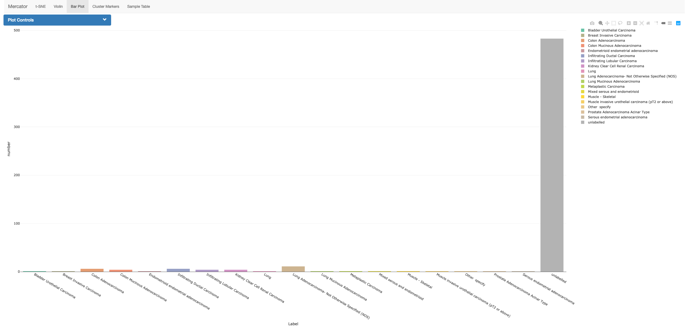
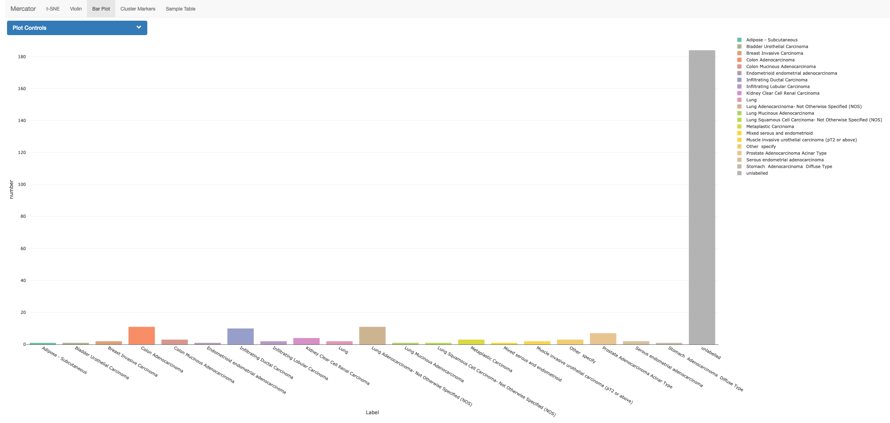

```{r setup, echo=0, warning=0, message=0}

options(stringsAsFactors=F)

```

If we look at the bar graphs for clusters 31 and 35, we see a variety of TCGA cancer types in both cases.





Generally, TCGA cancer types cluster with each other, so clearly something is causing these samples to specifically cluster with each other.

Investigating the samples around cluster 35 reveals that many are formalin-fixed, paraffin-embedded (FFPE).
This is a common storage method for tissue samples that is known to cause degradation of both DNA and RNA molecules.
We can see the storage method of TCGA samples using the rangedSummarizedExperiment object offered by the recount package.

```r
library(recount)

download_study('TCGA')
```

```{r load-tcga, message=0, warning=0}
load('data/TCGA/rse_gene.Rdata')

ffpe.dat <- colData(rse_gene)[,c(108,181)] ### TCGA metadata has over 200 columns, two of which correspond to ffpe storage

## combine columns with OR
ffpe.dat$ffpe <- (ffpe.dat[,1] | ffpe.dat[,2] == 'YES')

all.sample.table <- read.table('data/all_samples.csv',sep=',',header=T,row.names=1,stringsAsFactors=F)
rownames(all.sample.table) <- all.sample.table$run_id

ffpe.dat$clus <- as.character(all.sample.table[rownames(ffpe.dat),'Louvain'])

cont.tab <- data.frame(ffpe=rep(0,3),non_ffpe=rep(0,3))
rownames(cont.tab) <- c('31','35','other')

ffpe.dat$clus[!ffpe.dat$clus %in% c(31,35)] <- 'other'

cont.tab$ffpe <- table(subset(ffpe.dat,ffpe)$clus)
cont.tab$non_ffpe <- table(subset(ffpe.dat,!ffpe)$clus)

print(cont.tab)
```

As we can see, essentially all the FFPE samples are in clusters 31 or 35, with a number of samples labelled as non-ffpe in those clusters as well.
Examining the expression patterns of these samples reveals similar patterns of degradation, with similarily downregulated genes.
We can download the marker gene table from Mercator for cluster 35 to see this pattern.

```r
clus_35_markers <- read.table('data/marker_genes_35.csv',sep=',',header=T,row.names=1)

### we restrict to genes used in clustering again, to specificially choose genes associated with clustering
var.genes <- readRDS('data/recount_over50_pc3sd_tpm_log_90th_perc_var_genes.RDS')

clus_35_markers <- clus_35_markers[rownames(clus_35_markers) %in% var.genes,]

### load TCGA gene data and TPM normalize
cnt.dat <- assays(rse_gene)$counts
cnt.dat <- cnt.dat[var.genes,]
cnt.dat <- cnt.dat / rowData(rse_gene)[rownames(cnt.dat),'bp_length']
normFactors <- colSums(cnt.dat)
cnt.dat <- 1e6 * data.matrix(cnt.dat) %*% diag(1/normFactors,nrow=length(normFactors))
colnames(cnt.dat) <- rownames(colData(rse_gene))

cnt.dat <- t(cnt.dat[rownames(clus_35_markers)[1:10],])
cnt.dat <- data.frame(cnt.dat)
colnames(cnt.dat) <- clus_35_markers[1:10,'Symbol']
cnt.dat$clus <- ffpe.dat[rownames(cnt.dat),'clus']
```

```{r ffpe-load, echo=0}

### TPM normalization is quite slow, so we saved this intermediate step to ease processing the report
cnt.dat <- read.table('data/ffpe_count_matrix.csv',sep=',',header=T)

```

```{r ffpe-violins, warning=0, message=0,fig.width=12,fig.height=8}
library(reshape2)
library(ggplot2)
library(RColorBrewer)

plot.df <- melt(cnt.dat,id='clus')
plot.df$clus <- factor(plot.df$clus,levels=c('31','35','other'),labels=c('Aberrant TCGA Cluter','FFPE Cluster','Other TCGA'))

color.pal <- brewer.pal(3,'Dark2')

g <- ggplot(data=plot.df,aes(x=variable,y=log2(value+1),fill=clus,colour=clus)) + geom_violin(alpha=0.5,scale='width') +
    scale_colour_manual(values=c(color.pal[1],color.pal[2],color.pal[3])) +
    scale_fill_manual(values=c(color.pal[1],color.pal[2],color.pal[3])) +
    ylab('log2(TPM + 1)') +
    xlab('') +
    theme(axis.ticks.x=element_blank(),
          legend.position='bottom',
          legend.title=element_blank(),
          axis.text.x=element_text(size=12),
          axis.text.y=element_text(size=14),
          axis.title.y=element_text(size=20),
          legend.text=element_text(size=20)) 

g

```
